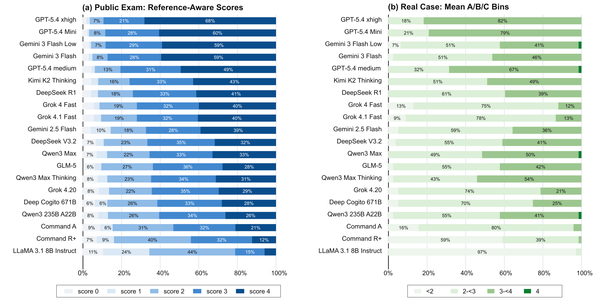
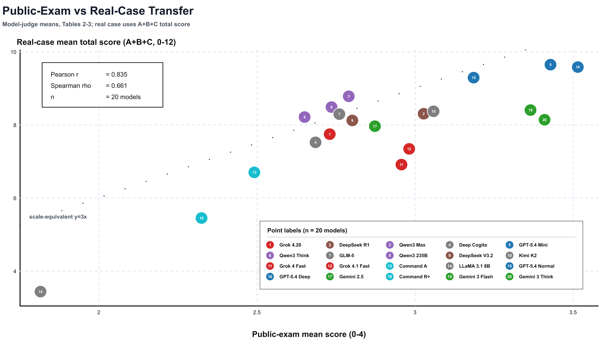
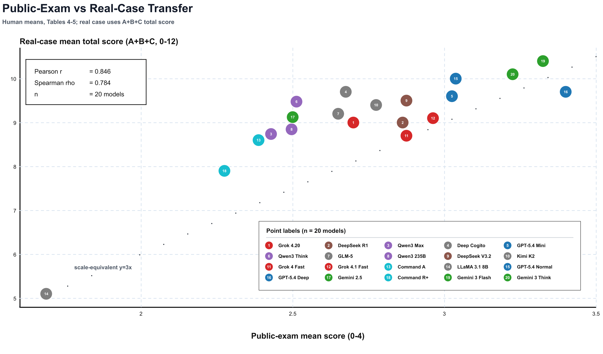
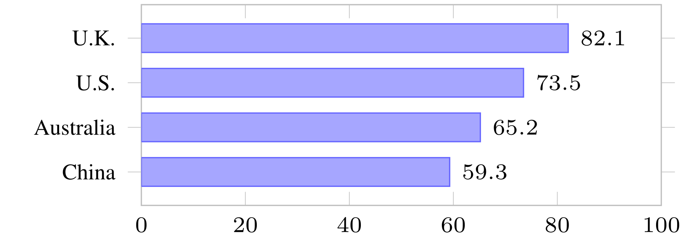

# Results Summary

This page summarizes the public-facing results in the current manuscript without
releasing the full paper or the full response matrix.

## Headline Performance

Across 20 model groups, the public-exam mean is `72.0` and the real-case mean is
`65.3` on the 0-100 scale. The real-case dimensions separate sharply:

| Real-case dimension | Mean |
| --- | ---: |
| Citation relevance | 67.8 |
| Constraint extraction | 54.8 |
| Argument validity | 73.3 |

The central failure is therefore not an inability to write plausible legal arguments.
Models often produce coherent argument forms while missing the operative rule
conditions, factual boundaries, or stance constraints that make those arguments
legally controlled.

## Score Distribution

Constraint-extraction scores are especially concentrated: `64.8%` receive a score of
2 and only `0.9%` receive 4. By comparison, argument validity has `49.3%` at 3 and
`24.3%` at 4.

## Exam-to-Case Transfer: Model-Judge Scores

Public-exam performance is positively related to real-case performance, but the
relationship is not deterministic:

| Transfer metric | Value |
| --- | ---: |
| Pearson correlation | 0.835 |
| Spearman correlation | 0.661 |
| Model groups | 20 |

The China public-exam subset gives the strongest transfer signal (`r = 0.868`,
`rho = 0.805`). Reasoning-mode and within-family gains do not transfer uniformly;
for example, GPT-5.4 xhigh improves on GPT-5.4 Mini by `2.2` public-exam points but
scores `0.6` points lower on the real-case mean.

## Exam-to-Case Transfer: Lawyer 1 Scores

The Lawyer 1-scored common subset shows the same broad transfer pattern:

| Transfer metric | Value |
| --- | ---: |
| Pearson correlation | 0.846 |
| Spearman correlation | 0.784 |
| Model groups | 20 |

These values measure exam-to-case transfer under one lawyer's scores. They are not
model-human agreement statistics.

## Source and Case-Category Effects

| Public-exam group | N | Mean |
| --- | ---: | ---: |
| United Kingdom | 86 | 82.1 |
| United States | 604 | 73.5 |
| Australia | 78 | 65.2 |
| China | 100 | 59.3 |

These differences should be read as source and format effects, not intrinsic
jurisdictional difficulty. In the real-case split, the 256 prompts comprise 202 Tort,
34 Contract, and 20 Property prompts. Contract prompts score higher on constraint
extraction (`61.9`) than Tort prompts (`53.4`).

## Human Validation

| Validation set | Answer-level Pearson | Answer-level Spearman | Model-level Pearson | Model-level Spearman |
| --- | ---: | ---: | ---: | ---: |
| Public exams | 0.925 | 0.928 | 0.992 | 0.986 |
| Real cases, pooled lawyers | 0.422 | 0.364 | 0.800 | 0.577 |

The 80-item public-exam subset contains 1,600 answers; the 10-prompt real-case subset
contains 200 answers. Real-case human scores use the equal-weight mean of two practicing
Chinese lawyers. Both lawyers place constraint extraction below argument validity,
although their pooled scores do not support calling it the lowest human-rated dimension
because citation relevance is lower still.

## Reliability Audit

The clustered robustness analysis uses an audited subset of 76 prompts from 15
judgments (1,520 answers) and 10,000 bootstrap draws. A separate evaluator-stability
check scores the same 200 blinded answers five times. Constraint extraction remains
the lowest automatic dimension in every run, but it is also the least stable dimension.
These audits are sensitivity evidence and do not replace the headline results over all
256 prompts.
